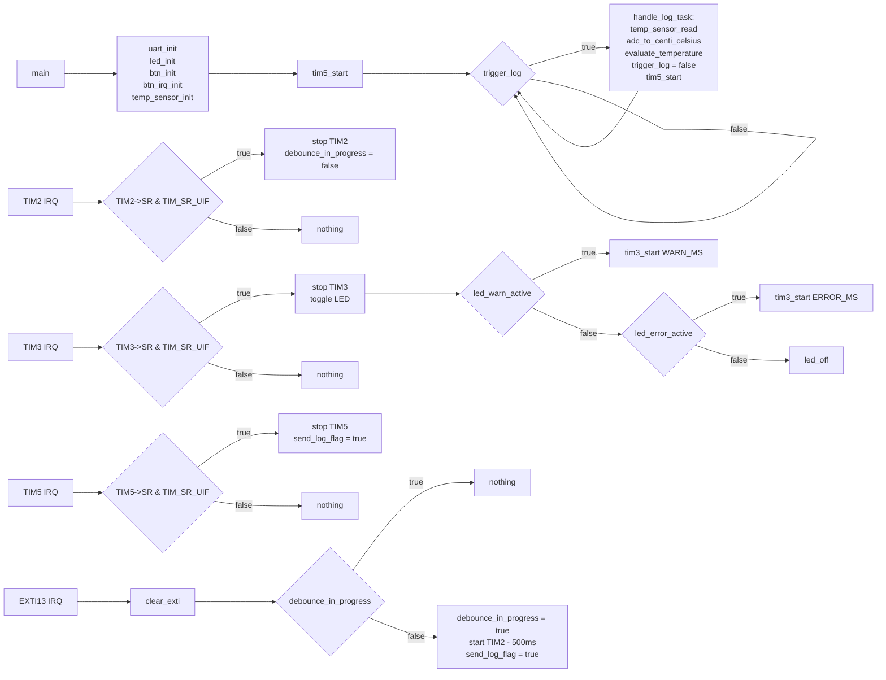

# Thermal Monitoring Unit for Industrial Controllers (PoC)

## Overview

This repository contains the PoC of a **Thermal Monitoring Unit** developed for an industrial control system. It simulates a real-world embedded application running on the **STM32F401RE Nucleo board**, without any external peripherals or sensors.

This project demonstrates professional-level skills in:

* Bare-metal embedded development (no RTOS, no HAL)
* Direct register manipulation and peripheral control
* Cortex-M architecture (ARMv7-M) and STM32F4 peripheral usage

---

## 🎯 Objective

Design and implement a **temperature monitoring subsystem** capable of:

* Reading the **internal temperature sensor** via ADC1 channel 16
* Reporting system health via UART logs
* Triggering **visual thermal alarms** based on temperature thresholds
* Supporting operator-triggered diagnostic logs via EXTI/button
* Demonstrating precise timer-based scheduling, blinking, and debouncing

---

## 💡 Key Concepts

* **Bare-Metal Development** (no CMSIS/HAL abstractions)
* **ARM Cortex-M4 register-level programming**
* **ADC1** for internal temperature sensor (channel 16)
* **UART** serial communication with formatted logging
* **Timers (TIM2, TIM3, TIM5)** for:
  * Manual debounce
  * Periodic events
  * Alarm blinking
* **EXTI13** interrupt for user button (B1)
* **Integer-based fixed-point temperature conversion**
* **Stateful LED alarm patterns (1 Hz and 5 Hz blinking)**

---

## 🔍 How It Works

### Internal Temperature Sensing

* The STM32F401RE's **TSVREFE** bit is set in `ADC->CCR` to enable internal temperature sensor.
* ADC1 (channel 16) performs a single conversion, and the raw ADC value is converted to temperature using integer arithmetic.

### Logging System

* **UART** sends temperature logs every 5 seconds.
* Logs include severity levels: `[INFO]`, `[WARNING]`, and `[ERROR]`.

### LED Alarms

* When thresholds are exceeded:
  * **Warning**: LED blinks at 1 Hz
  * **Error**: LED blinks at 5 Hz
* TIM3 controls blinking patterns.

### Button Press & Debounce

* User can press the blue push-button to manually request a temperature reading.
* EXTI13 triggers TIM2 for a **500ms debounce window**.

### Timer Roles

| Timer | Role                       |
| ----- | -------------------------- |
| TIM2  | Debounce logic             |
| TIM3  | Blinking frequency control |
| TIM5  | 5-second log interval      |

### Diagrams

---

## 🔧 Tools & Requirements

* **MCU**: STM32F401RE (Cortex-M4F)
* **Board**: STM32 Nucleo F401RE
* **Toolchain**: GCC ARM / STM32CubeIDE
* **Language**: C (bare-metal)
* **Debug**: ST-Link, UART terminal

---

## ⚠️ Common Pitfalls

* ADC values from internal temperature sensor vary significantly based on calibration and VREF.
* Debouncing must be handled carefully to avoid false triggers during EXTI handling.
* TIMx\_SR\_UIF (update interrupt flag) must be manually cleared.
